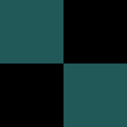

#  DENGID ENGINE

Custom game engine specialized for 2D pixelart games.

Currently, it is in developing process.

---

To build the engine;

- clone the repository

- install docker (if not installed)

- build the docker image using the dockerfile
```sh
docker build -t dengid-builder:v0.2 .
```

- run build.sh file
```sh
./build.sh
```

Then, the engine executable will be created inside the `engine_build` directory.

To run;
```sh
./engine_build/dengid
```
