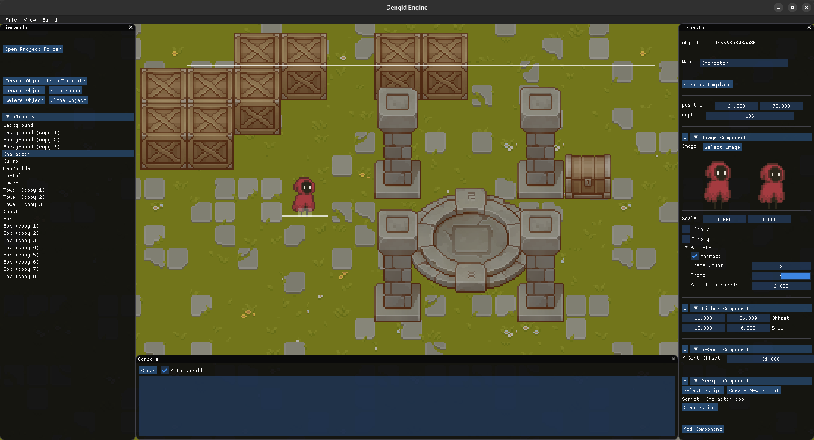

# DENGID ENGINE

<p align="center">
  
</p>

## Minimal and modular 2D game engine for pixel art games

**DENGID ENGINE** is a lightweight and modular 2D game engine designed from scratch in C++, focused specifically on the needs of **pixel art games**.

It comes with a built-in editor, a component-based architecture, and the ability to build standalone executables. Its goal is to provide **clarity**, **simplicity**, and **full control** for developers who want to understand how game engines work — or just want to make cool 2D games.

---



---

## Key Features

- ⚙️ Custom-built C++ engine with SDL2 and Dear ImGui
- 🧱 Component-based architecture (Image, Script, Hitbox, YSort)  
- 🧠 Simple script integration using C++ templates  
- 📝 JSON-based scene and object template system (.obte)  
- 🎮 Real-time input handling and camera system  
- 🛠️ Editor for scene editing, object manipulation, and debugging  
- 📦 Build system to generate standalone game executables  

> Rendering is done through SDL2’s hardware-accelerated pipeline, which uses **OpenGL** under the hood for efficient 2D drawing and scaling.

> ⚠️ **Note:** The engine currently runs only on Linux.
> macOS and Windows support will be considered in future releases.

---

## 🚀 Building the Engine

1. Install Docker  
2. Build the Docker image:
```sh
docker build -t dengid-builder:v0.2 .
```
3. Run the build script:
```sh
./build.sh
```
The built engine will appear in ./engine_build/dengid.

### Running the Editor
```sh
./engine_build/dengid
```

You can create a new project or open an existing one. Projects are saved under ~/dengid-projects/.
